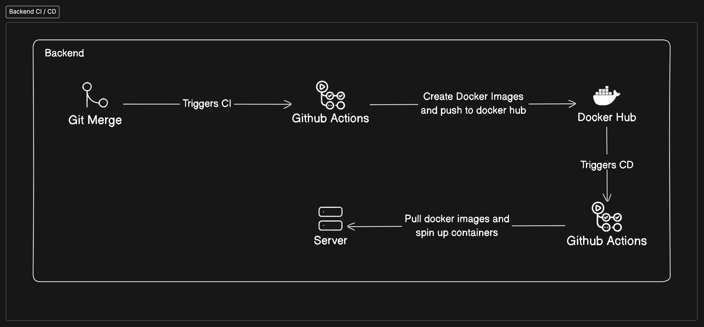
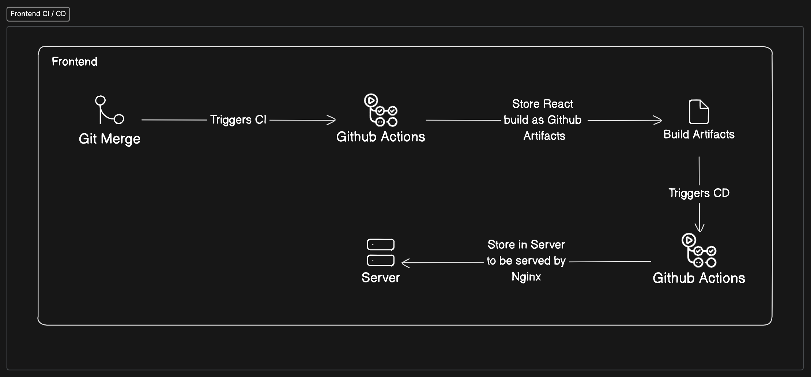

# Project Listings

A freelance project marketplace platform with real-time communication, offline support, and a microservices architecture. Built using TypeScript.

## 🚀 Features

### User Management

-   👤 Freelancer and Client user roles
-   🔐 Secure login and signup system using Passport JS and JWT
-   🛡️ Protected routes for authenticated users

### Project Management

-   📋 Paginated project listing
-   ✏️ Full CRUD operations for projects and bids
-   📝 Rich text editor with AI autocomplete suggestions
-   📎 File upload capability for projects
-   💬 Commenting system on projects

### Bidding & Communication

-   🤝 Freelancers can submit bids on projects
-   📨 Real-time chat between client and freelancer after bid acceptance
-   ♾️ Infinite scroll with lazy loading for chat history

### Offline Support

-   🔄 Offline-first architecture for project/bid submissions
-   💾 Local storage of data using Redux Persist
-   🔁 Automatic synchronization when back online
-   📱 Progressive Web App (PWA) with cached pages/data

### Notifications

-   🔔 Real-time push notifications
-   🎯 Custom toast implementation

## 🛠️ Tech Stack

### Frontend

-   **React.js** using Vite
-   **Redux** & **Redux Saga** for backend sync
-   **Redux Persist** for offline data persistence
-   **React Quill** with AI autocomplete
-   **Progressive Web App** (PWA) implementation

### Backend

-   Microservices Architecture:
    -   **GraphQL Server**: Real-time features (notifications, chat)
    -   **Express Server**: Authentication, CRUD operations

### Database

-   **PostgreSQL** with Pub/Sub for real-time features

### Monitoring

-   **Sentry** integration for error reporting (frontend & backend)

### DevOps & Deployment

-   **AWS EC2** hosting
-   **Docker** containerization
-   **Nginx** as reverse proxy
-   **Backend Deployment**: Docker-based deployment using GitHub Actions pipeline
    
-   **Frontend Deployment**: GitHub artifacts with GitHub Actions pipeline
    

## 🏗️ Architecture Overview


## 🚦 Getting Started

### Prerequisites

-   Node.js (v18 or later)
-   Docker
-   PostgreSQL

### Installation

1. Clone the repository

```bash
git clone https://github.com/omar-sarfraz/projects-listing
```

2. Install Dependencies

```bash
yarn install
```

2. Frontend

```bash
cd React_Project
cp .env-example .env  # Create env file
npm run dev
```

3. Backend services

```bash
cd ..
cp .env-example .env
docker-compose up
```

## 📄 License

This project is licensed under the MIT License.
